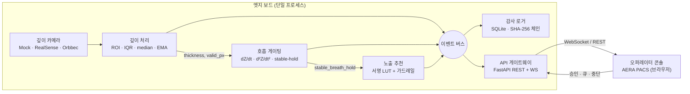

# AERA PACS · Smart X-ray Assist

> 흉부 일반촬영용 **호흡 게이팅 노출 보조** 시스템 — Phase 1 MVP (Operator Assist)

깊이 카메라가 환자의 흉부 표면을 관찰해 **두께를 측정**하고, **안정적인 호흡 정지(breath-hold)** 를 검출한 뒤, 서명된 룩업 테이블에서 kVp/mAs를 **제안(suggest)** 합니다. 모든 제안은 작업자의 명시적 승인을 거치며, **시스템은 절대 X선을 발사하지 않습니다.** 어떤 결함이든 발생하면 즉시 **수동 모드(safe state)** 로 떨어지고, X선 장비 고유의 수동 워크플로는 전혀 건드리지 않습니다.

하드웨어 없이 **합성(mock) 깊이 카메라**로 전 과정이 end-to-end 동작합니다.

```
상태: Phase 1 MVP · 유닛/통합 테스트 42개 통과 · 참고 전용(reference-only)
```

---

## 핵심 설계 원칙

| 원칙 | 의미 |
|---|---|
| **Reference-only** | kVp/mAs는 참고 값. 작업자 승인 전엔 아무것도 적용되지 않음 |
| **Never fires** | 시스템은 X선을 발사하지도, 장비 파라미터를 설정하지도 않음 |
| **Fail to manual** | 카메라 끊김·보정 드리프트·저신뢰 프레임 → 즉시 수동 모드, 제안 비활성화 |
| **Signed & auditable** | LUT·보정 프로파일은 서명됨. 모든 이벤트는 SHA-256 해시 체인에 기록 |

---

## 기술 스택

| 레이어 | 기술 | 용도 |
|---|---|---|
| **언어 / 런타임** | Python ≥ 3.10 · Vanilla JS (ES2020) | 백엔드 파이프라인 / 프론트 콘솔 |
| **수치 연산** | NumPy | 깊이 프레임 ROI·IQR·중앙값·EMA |
| **백엔드 API** | FastAPI · Uvicorn (single worker) | REST + WebSocket 게이트웨이 |
| **검증 / 스키마** | Pydantic v2 · jsonschema | 요청 검증 · 메시지 스키마 |
| **저장 / 감사** | SQLite (WAL) + 애플리케이션 레벨 SHA-256 해시 체인 | 변조 탐지 가능한 append-only 감사 로그 |
| **실시간** | WebSocket (`websockets`) | depth · respiration · recommendation · error 푸시 |
| **깊이 카메라** | 추상 `IDepthCamera` + 어댑터: Mock · Intel RealSense(`pyrealsense2`) · Orbbec(`pyorbbecsdk`) | 벤더 무관 프레임 소스, 런타임 교체·시리얼별 선택 |
| **설정** | PyYAML (camera / gating / exposure LUT / device) | 코드 변경 없는 튜닝 |
| **프론트엔드** | 단일 파일 HTML/CSS/JS · Canvas 2D · Web Storage | 프레임워크 0 의존 오퍼레이터 콘솔 (i18n · 설정 · 단축키) |
| **테스트** | pytest · httpx | 유닛 + 통합 (42 passed) |

> 각 컴포넌트의 **동작 원리**는 아래 [세부 문서](#세부-문서--원리)에서 다룹니다.

---

## 아키텍처 개요



파이프라인은 이벤트 버스로만 통신하므로, 향후 ZeroMQ/NNG로 프로세스를 쪼개도 **버스 교체**만으로 끝나며 재작성이 없습니다.

---

## 빠른 시작

```bash
cd smart-xray-assist
python3 -m pip install -e ".[dev]"        # numpy, fastapi, pydantic, pytest …

# 1) 헤드리스 — mock 파이프라인 구동, 1초마다 상태 출력
python3 scripts/run_mvp.py --headless --seconds 10

# 2) 서버 + 오퍼레이터 콘솔
python3 scripts/run_mvp.py                # http://localhost:8080/

# 3) 테스트
python3 -m pytest -q                      # 42 passed
```

실제 하드웨어(엣지 보드)에서는 SDK를 함께 설치합니다:

```bash
python3 -m pip install -e ".[realsense]"  # 또는 .[orbbec]
```

콘솔에서 **설정(⚙) → 카메라**를 열면 연결된 기기가 벤더·시리얼별로 열거되어 개별 선택·연결됩니다.

---

## 저장소 구조

```
.
├── index.html                     # 오퍼레이터 콘솔 (AERA PACS) — 단일 파일 프론트엔드
├── smart-xray-assist/             # 백엔드 (Phase 1 MVP)
│   ├── src/xray_assist/
│   │   ├── app.py                 # 오케스트레이터: 파이프라인·세션·safe-state
│   │   ├── api/gateway.py         # FastAPI REST + WebSocket
│   │   ├── camera/                # IDepthCamera + 어댑터 + discovery
│   │   ├── depth/                 # 깊이 처리 + 보정
│   │   ├── gating/                # 호흡 게이팅 상태 기계
│   │   ├── exposure/              # LUT 추천 + 가드레일
│   │   ├── audit/                 # SHA-256 해시 체인 로거
│   │   └── common/                # 이벤트 버스 · 메시지 · 설정 · 에러
│   ├── configs/                   # camera · gating · exposure_lut · device (YAML)
│   ├── migrations/                # SQLite 스키마
│   └── tests/
├── docs/                          # ▼ 세부 원리 문서
└── Ko/ · en/                      # 설계·규제·검증 문서 (한/영)
```

---

## 세부 문서 · 원리

각 문서는 해당 컴포넌트의 **왜(원리)** 와 **어떻게(구현)** 를 함께 설명합니다.

1. [아키텍처 & 파이프라인](docs/architecture.md) — 단일 프로세스 파이프라인, 이벤트 버스, 세션/safe-state 수명주기
2. [깊이 처리 & 호흡 게이팅](docs/depth-and-gating.md) — 9단계 깊이 파이프라인, 두께 산출, EMA·분산 기반 안정 검출, 기침 abort 수학
3. [노출 추천 & 안전](docs/exposure-and-safety.md) — 서명 LUT, 가드레일 클램프, reference-only·수동 모드·safe-state
4. [감사 해시 체인](docs/audit-chain.md) — append-only SQLite, SHA-256 체인, 변조 탐지·검증
5. [카메라 추상화 & 멀티카메라](docs/camera-abstraction.md) — `IDepthCamera`, 어댑터 팩토리, discovery, 시리얼별 선택
6. [API & 실시간](docs/api-and-realtime.md) — REST 엔드포인트, WebSocket 토픽, 메시지 계약
7. [오퍼레이터 콘솔](docs/operator-console.md) — 라이브 배선, 파형 렌더, i18n, 설정, 단축키

---

## 라이선스 / 규제 주석

본 저장소는 Phase 1 MVP 참조 구현입니다. **참고 전용**이며 진단·치료용 의료기기 승인 대상 소프트웨어가 아닙니다. 임상 사용을 위해서는 별도의 검증(V&V)·규제 승인·서명 키 관리 체계가 필요합니다. 설계·규제·검증 문서는 [`Ko/`](Ko) · [`en/`](en) 참고.
