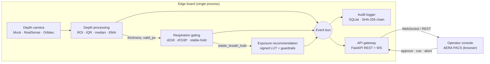
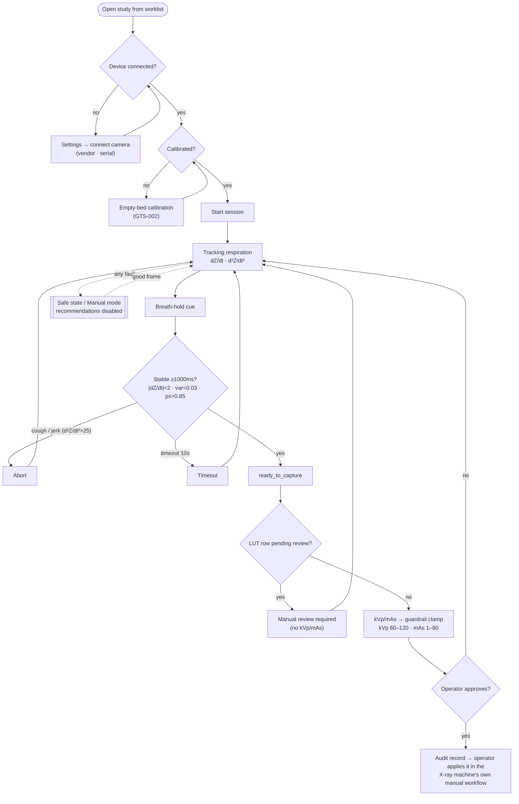

# AERA PACS · Smart X-ray Assist

> **Respiration-gated exposure assist** for plain-film chest X-ray — Phase 1 MVP (Operator Assist)

*[한국어 README](README.ko.md)*

A depth camera watches the patient's chest, **measures thickness**, detects a **stable breath-hold**, and **suggests** kVp/mAs from a signed lookup table. Every suggestion requires explicit operator approval, and **the system never fires the X-ray.** On any fault it drops to a visible **Manual Mode (safe state)**, leaving the X-ray machine's own manual workflow completely untouched.

The whole pipeline runs **end-to-end with no hardware** via a synthetic (mock) depth camera.

```
Status: Phase 1 MVP · 42 unit + integration tests passing · reference-only
```

---

## Design principles

| Principle | Meaning |
|---|---|
| **Reference-only** | kVp/mAs are advisory. Nothing is applied before operator approval. |
| **Never fires** | The system neither triggers the X-ray nor sets any generator parameter. |
| **Fail to manual** | Camera loss · calibration drift · low-confidence frame → immediate Manual Mode, suggestions disabled. |
| **Signed & auditable** | LUT and calibration profiles are Ed25519-signed. Every event is recorded in a SHA-256 hash chain. |

---

## Tech stack (implemented — Phase 1 MVP)

| Layer | Technology | Role |
|---|---|---|
| **Language / runtime** | Python ≥ 3.10 · Vanilla JS (ES2020) | Backend pipeline / operator console |
| **Numerics** | NumPy | Depth-frame ROI · IQR · median · EMA |
| **Backend API** | FastAPI · Uvicorn (single worker) | REST + WebSocket gateway |
| **Validation / schema** | Pydantic v2 · jsonschema | Request validation · message schemas (`schemas/`) |
| **Storage / audit** | SQLite (WAL) + app-level SHA-256 hash chain | Append-only, tamper-evident audit log |
| **Realtime** | WebSocket (`websockets`) | Push depth · respiration · recommendation · error |
| **Depth camera** | Abstract `IDepthCamera` + adapters: Mock · Intel RealSense (`pyrealsense2`) · Orbbec (`pyorbbecsdk`) | Vendor-agnostic frame source, runtime swap, per-serial selection |
| **Config** | PyYAML (camera / gating / exposure LUT / device) | Tuning without code change |
| **Frontend** | Single-file HTML/CSS/JS · Canvas 2D · Web Storage | Zero-dependency operator console (i18n · settings · shortcuts) |
| **Tests** | pytest · httpx | Unit + integration (42 passed) |

> The **operating principles** of each component are documented in the [detailed docs](#detailed-docs--principles) below, enriched from the design specifications in [`en/files/`](en/files).

---

## Architecture overview



Services communicate **only through the event bus**, so splitting the pipeline across processes later (ZeroMQ/NNG) is a bus swap — not a rewrite.

---

## Operational flow

End-to-end operator journey, with the gating decisions and the safety branch that overrides every state:



The system **stops at the audit record** — it never fires the X-ray. See [Depth & gating](docs/depth-and-gating.md) and [Exposure & safety](docs/exposure-and-safety.md).

---

## Quick start

```bash
cd smart-xray-assist
python3 -m pip install -e ".[dev]"        # numpy, fastapi, pydantic, pytest …

# 1) headless — drive the mock pipeline, print state once a second
python3 scripts/run_mvp.py --headless --seconds 10

# 2) server + operator console
python3 scripts/run_mvp.py                # http://localhost:8080/

# 3) tests
python3 -m pytest -q                      # 42 passed
```

On real hardware (edge board), install the vendor SDK alongside:

```bash
python3 -m pip install -e ".[realsense]"  # or .[orbbec]
```

Open **Settings (⚙) → Camera** in the console: connected devices are enumerated by vendor + serial for individual selection and connection.

---

## Repository layout

```
.
├── index.html                     # Operator console (AERA PACS) — single-file frontend
├── smart-xray-assist/             # Backend (Phase 1 MVP)
│   ├── src/xray_assist/
│   │   ├── app.py                 # Orchestrator: pipeline · session · safe-state
│   │   ├── api/gateway.py         # FastAPI REST + WebSocket
│   │   ├── camera/                # IDepthCamera + adapters + discovery
│   │   ├── depth/                 # Depth processing + calibration
│   │   ├── gating/                # Respiration gating state machine
│   │   ├── exposure/              # LUT recommender + guardrails
│   │   ├── audit/                 # SHA-256 hash-chain logger
│   │   └── common/                # Event bus · messages · config · errors
│   ├── configs/                   # camera · gating · exposure_lut · device (YAML)
│   ├── migrations/                # SQLite schema
│   └── tests/
├── docs/                          # ▼ Detailed principle docs (EN + .ko.md)
└── en/ · Ko/                      # Design · regulatory · V&V specifications (EN/KR)
```

---

## Detailed docs · principles

Each doc explains both the **why (principle)** and the **how (implementation)**.

**Core pipeline**
1. [Architecture & pipeline](docs/architecture.md) — single-process pipeline, event bus, transport map, session/safe-state lifecycle
2. [Depth processing & respiration gating](docs/depth-and-gating.md) — 9-step depth pipeline, thickness derivation, EMA/variance stability detection, cough-abort math
3. [Exposure recommendation & safety](docs/exposure-and-safety.md) — signed LUT, guardrail clamps, reference-only · manual mode · safe-state
4. [Audit hash chain](docs/audit-chain.md) — append-only SQLite, SHA-256 chain, tamper detection & verification
5. [Camera abstraction & multi-camera](docs/camera-abstraction.md) — `IDepthCamera`, adapter factory, discovery, per-serial selection
6. [API & realtime](docs/api-and-realtime.md) — REST endpoints, WebSocket topics, message envelope & contracts
7. [Operator console](docs/operator-console.md) — live wiring, waveform rendering, i18n, settings, shortcuts

**Engineering context (from `en/files/` specifications)**
8. [Hardware & deployment](docs/hardware-and-deployment.md) — target cameras/boards, release bundle, systemd, kiosk
9. [Safety, risk & regulatory](docs/safety-risk-regulatory.md) — standards (IEC 62304 / ISO 14971 …), device classification, hazard analysis, fault injection
10. [Verification & validation](docs/verification.md) — test levels, Golden Test Suite (GTS-*), UT/IT/FI IDs, acceptance criteria

---

## Roadmap (from design specs)

| Phase | Scope | Risk | Representative stack shift |
|---|---|---|---|
| **1 — Operator Assist** *(this repo)* | Reference-only suggestions, operator approval | Low–Medium | Python · FastAPI · RealSense D455 · RPi 5 / Jetson Orin Nano |
| **2 — Workstation Agent** | Semi-automatic parameter entry, indirect control | Medium–High | Go gateway · Orbbec Femto Mega I (PoE) · Jetson Orin Nano Super (TensorRT) |
| **3 — Generator Direct** | Direct X-ray control | High | Rust (Axum) safety services · IEC 62304 Class C compiler (Ferrocene) · HIL safety tests |

Phase 1 has **zero electrical connection** to the X-ray equipment — which deliberately excludes it from higher electrical-safety scope. See [Safety, risk & regulatory](docs/safety-risk-regulatory.md).

---

## License / regulatory note

This repository is a Phase 1 MVP reference implementation. It is **reference-only** and is **not** an approved diagnostic/therapeutic medical device. Clinical use requires separate V&V, regulatory clearance, and a production signing-key management system. Design, regulatory, and verification specifications live in [`en/`](en) · [`Ko/`](Ko).
