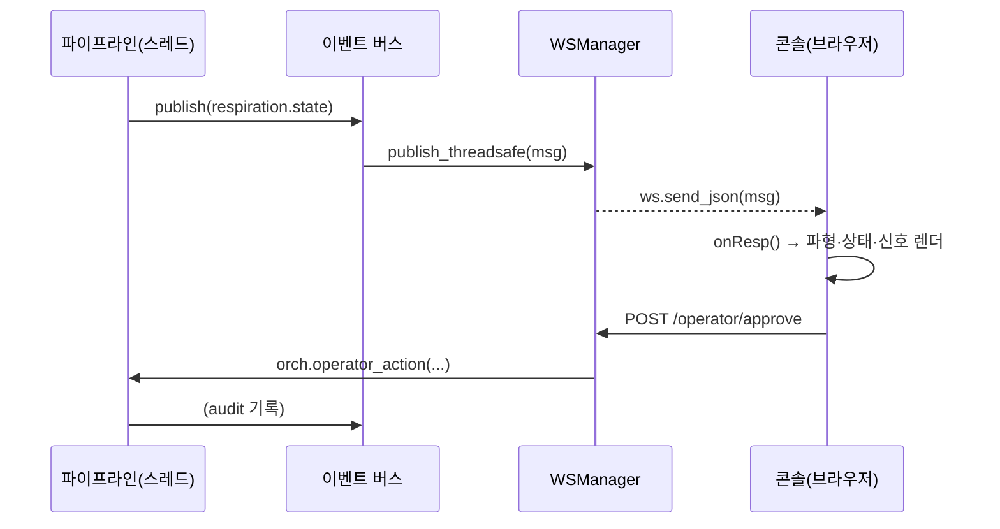

# API & 실시간

[← README로](../README.md)

[`api/gateway.py`](../smart-xray-assist/src/xray_assist/api/gateway.py) — FastAPI 단일 워커. REST로 명령·조회, WebSocket으로 파이프라인 이벤트를 브라우저에 푸시합니다. 게이트웨이는 오케스트레이터 위의 얇은 껍데기이며 **로컬 전용**(외부 네트워크에 닿지 않음)입니다.

## REST 엔드포인트

| 메서드 · 경로 | 용도 | 바디 / 반환 |
|---|---|---|
| `GET /api/v1/health` | 헬스·서비스 상태 | → `{status, device_id, uptime_s, services{}}` |
| `GET /api/v1/state` | 스냅샷 | → `{session_id, mode, camera, calibration, respiration_state, safe_state}` |
| `POST /api/v1/sessions` | 세션 시작(추적 재무장) | `{body_region, patient_mode}` → `{session_id, status}` |
| `GET /api/v1/devices` | 카메라 열거 | → `{active{provider,serial}, connected, providers[]}` |
| `POST /api/v1/devices/connect` | 기기 연결 | `{provider, serial}` → `{status, device{...}}` |
| `POST /api/v1/devices/disconnect` | 기기 해제 | → `{status, provider}` |
| `GET /api/v1/audit` | 감사 로그 | `?limit=60` → `{entries[]}` |
| `GET /api/v1/audit/verify` | 해시 체인 검증 | → `{ok, count}` |
| `POST /api/v1/operator/approve` | 추천 승인 | `{session_id, recommendation_id, operator_id}` → `{status, audit_id}` |
| `POST /api/v1/operator/action` | 작업자 액션 | `{session_id, operator_id, action, payload}` → `{status, audit_id}` |

### 작업자 액션(`action`)

`play_breath_cue` · `trigger_cough` · `switch_manual_mode` · `abort` · `approve_recommendation`

모든 액션은 **효과가 적용되기 전에** 감사에 기록됩니다(api-schema.md). 예: `play_breath_cue`는 게이팅에 큐를 요청하고, mock 카메라에서는 환자가 호흡을 참는 상황을 시뮬레이션해 데모가 `stable_breath_hold`에 도달하게 합니다.

## WebSocket — `/ws/v1/events`

파이프라인 버스의 네 토픽을 그대로 브로드캐스트합니다:

| `type` | 페이로드 핵심 |
|---|---|
| `depth.summary` | `measurement{median_depth_mm, mean_depth_mm, estimated_thickness_mm, valid_pixel_ratio}, quality{confidence}` |
| `respiration.state` | `state, signal{z_mm, dz_dt_mm_s, d2z_dt2_mm_s2, stable_duration_ms}, gating{window_open, ready_to_capture, abort, reason}` |
| `exposure.recommendation` | `recommendation_id, recommendation{kvp, mas, source, model_hash}, input{...}, guardrails{within_min_max, manual_review_required}, display{...}` |
| `system.error` | `code, severity, message, safe_state_entered, recommended_operator_action` |

### 재연결·스냅샷

- 클라이언트가 접속하면 게이트웨이는 각 토픽의 **마지막 메시지**를 즉시 보냅니다 → 재접속한 콘솔이 상태를 재구성.
- 파이프라인은 다른 스레드에서 돌 수 있으므로, 버스→WS 브리지는 `run_coroutine_threadsafe`로 이벤트 루프에 안전하게 넘깁니다.
- 콘솔은 지수 백오프로 자동 재연결하고, 15초마다 ping을 보냅니다.

## 실시간 데이터 흐름

관련: [오퍼레이터 콘솔](operator-console.md) · [아키텍처](architecture.md)
