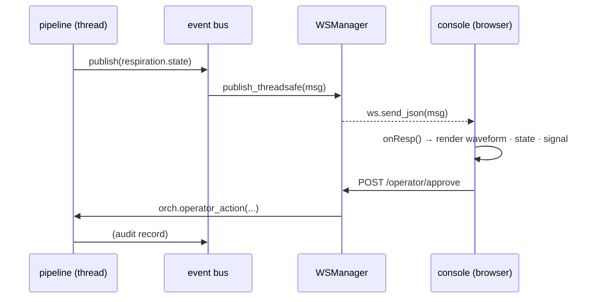

# API & realtime

[← back to README](../README.md) · [한국어](api-and-realtime.ko.md)

[`api/gateway.py`](../smart-xray-assist/src/xray_assist/api/gateway.py) — FastAPI single worker. REST for commands/queries, WebSocket to push pipeline events to the browser. The gateway is a thin shell over the orchestrator and is **local-only** (never reaches an external network).

## Message envelope

Every message carries a common envelope (`en/files/api-schema.md`), versioned with semver (major bump on any breaking change):

```json
{
  "schema_version": "1.0.0",
  "timestamp_ms": 1710000000000,   // wall clock
  "monotonic_ms": 5839201,         // ordering / latency
  "device_id": "edge-001",
  "session_id": "sess_20260624_000001"
}
```

All messages are validated against JSON Schemas in [`schemas/`](../smart-xray-assist/schemas) before processing.

## REST endpoints

| Method · path | Purpose | Body / returns |
|---|---|---|
| `GET /api/v1/health` | health · service status | → `{status, device_id, uptime_s, services{}}` |
| `GET /api/v1/state` | snapshot | → `{session_id, mode, camera, calibration, respiration_state, safe_state}` |
| `POST /api/v1/sessions` | start session (re-arm tracking) | `{body_region, patient_mode}` → `{session_id, status}` |
| `GET /api/v1/devices` | camera enumeration | → `{active{provider,serial}, connected, providers[]}` |
| `POST /api/v1/devices/connect` | connect device | `{provider, serial}` → `{status, device{…}}` |
| `POST /api/v1/devices/disconnect` | disconnect | → `{status, provider}` |
| `GET /api/v1/audit` | audit log | `?limit=60` → `{entries[]}` |
| `GET /api/v1/audit/verify` | verify hash chain | → `{ok, count}` |
| `POST /api/v1/operator/approve` | approve recommendation | `{session_id, recommendation_id, operator_id}` → `{status, audit_id}` |
| `POST /api/v1/operator/action` | operator action | `{session_id, operator_id, action, payload}` → `{status, audit_id}` |

### Operator actions (`action`)

`play_breath_cue` · `trigger_cough` · `switch_manual_mode` · `abort` · `approve_recommendation`

Every action is **audited before it takes effect**. e.g. `play_breath_cue` requests a cue from gating, and on the mock camera it simulates a compliant breath-hold so the demo reaches `stable_breath_hold`.

## WebSocket — `/ws/v1/events`

Broadcasts the four pipeline bus topics as-is:

| `type` | Key payload |
|---|---|
| `depth.summary` | `roi{…confidence}`, `measurement{median_depth_mm, mean_depth_mm, std_depth_mm, valid_pixel_ratio, estimated_thickness_mm}`, `calibration{profile_id, bed_origin_mm}`, `quality{ir_saturation, motion_artifact, clothing_artifact_score, confidence}` |
| `respiration.state` | `state{idle…manual_mode}`, `signal{z_mm, dz_dt_mm_s, d2z_dt2_mm_s2, peak_phase, stable_duration_ms, breathing_period_ms}`, `gating{window_open, ready_to_capture, abort, reason}`, `quality{confidence, frame_drop_detected, motion_artifact}` |
| `exposure.recommendation` | `input{estimated_thickness_mm, body_region, patient_mode, confidence}`, `recommendation{kvp, mas, source, model_hash, confidence, operator_approval_required}`, `guardrails{within_min_max, pediatric_limit_applied, bariatric_offset_applied, manual_review_required}`, `display{message, severity}` |
| `system.error` | `code, severity, message, safe_state_entered, recommended_operator_action` |

Also published on the bus: `camera.frame_meta` (frame_id, camera vendor/model/serial, stream `z16`/`depth_scale_m`, shared-memory slot, quality) — consumed internally.

### Reconnect & snapshot

- On connect, the gateway immediately sends the **last message** of each topic, so a reconnecting console rebuilds state.
- The pipeline may run on another thread, so the bus→WS bridge hands events to the event loop via `run_coroutine_threadsafe`.
- The console reconnects with exponential backoff and pings every 15 s.

### Latency targets (spec)

| Path | Target | Test |
|---|---|---|
| event → UI state update | ≤ 500 ms | GTS-007 / IT-CORE-UI-001 (≤200 ms) |
| internal gating latency | ≤ 33 ms | TC-GATE-003 |
| error → safe state | ≤ 2 s | IT-SAFE-001 / FI-001 |

## Realtime data flow



Related: [Operator console](operator-console.md) · [Architecture](architecture.md)
