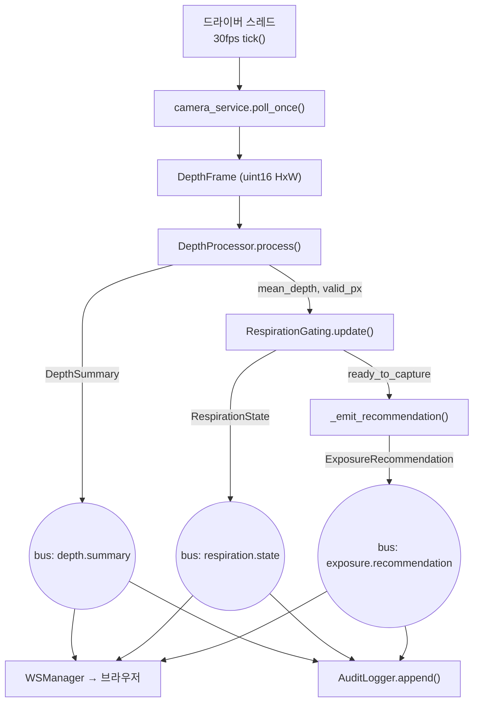

# 아키텍처 & 파이프라인

[← README로](../README.md)

## 프로세스 모델

Phase 1은 **단일 프로세스 파이프라인**입니다. 오케스트레이터([`app.py`](../smart-xray-assist/src/xray_assist/app.py))가 카메라 → 깊이 처리 → 게이팅 → 추천 → 감사를 이벤트 버스로 연결하고, 세션과 safe-state를 소유합니다.

**왜 단일 프로세스인가.** MVP는 지연·복잡도를 최소화하려 단일 워커로 시작합니다(tech-stack §10). 단, 서비스는 **버스를 통해서만** 통신하므로 전송 계층에 독립적입니다 — 나중에 ZeroMQ/NNG로 프로세스를 분리해도 버스 구현만 교체하면 됩니다.

## 이벤트 버스

[`common/event_bus.py`](../smart-xray-assist/src/xray_assist/common/event_bus.py) — 토픽별 pub/sub. 각 파이프라인 단계가 결과를 발행하면 두 구독자가 받습니다:

- **API 게이트웨이** — WebSocket으로 브라우저에 실시간 푸시
- **감사 로거** — 해시 체인에 기록

버스가 유일한 결합점이라, 파이프라인 코드는 "누가 듣는지" 모릅니다. 이것이 전송 독립성의 핵심입니다.

## 드라이버 & 세션 수명주기

- [`run_mvp.py`](../smart-xray-assist/scripts/run_mvp.py)의 **드라이버 스레드**가 카메라와 무관하게 30fps로 `tick()`을 돌립니다. 따라서 세션 없이도 `depth.summary`·`respiration.state`가 항상 스트리밍됩니다.
- **세션 시작**(`POST /api/v1/sessions`)은 게이팅의 `start_tracking()`을 호출해 추적을 재무장(re-arm)합니다.
- **추천**은 게이팅이 `ready_to_capture`에 도달할 때만 발행됩니다.

## Safe-state (수동 모드)

어떤 단계든 `SafeStateError`를 던지면 오케스트레이터가 safe-state로 진입합니다:

| 원인 | 코드 |
|---|---|
| 카메라 연결 끊김 | `CAMERA_DISCONNECTED` |
| 프레임 드롭 초과 / USB 2.0 폴백 | `FRAME_DROP_EXCEEDED` |
| ROI 유효 픽셀 부족 | `LOW_CONFIDENCE` |
| 빈 침대 평면 드리프트 | `CALIBRATION_DRIFT` |
| 보정 서명 불일치 | `CALIBRATION_MISSING` |
| 감사 DB 쓰기 실패 | `DB_WRITE_FAILED` |

safe-state에서는 **추천이 비활성화**되고 `system.error`가 발행되며, 콘솔은 즉시 수동 모드 오버레이를 띄웁니다. 좋은 프레임이 다시 처리되면 자동으로 해제됩니다(transient 결함 복구).

## 스레딩 주의점

드라이버 스레드가 파이프라인을 돌리는 동안, FastAPI 스레드풀이 REST 요청(승인·감사 조회 등)을 처리합니다. 두 스레드가 같은 SQLite 연결을 쓰므로:

- 연결은 `check_same_thread=False`
- 모든 감사 접근은 `RLock`으로 직렬화 (단일 라이터, append 원자성 보장)

관련: [감사 해시 체인](audit-chain.md)
