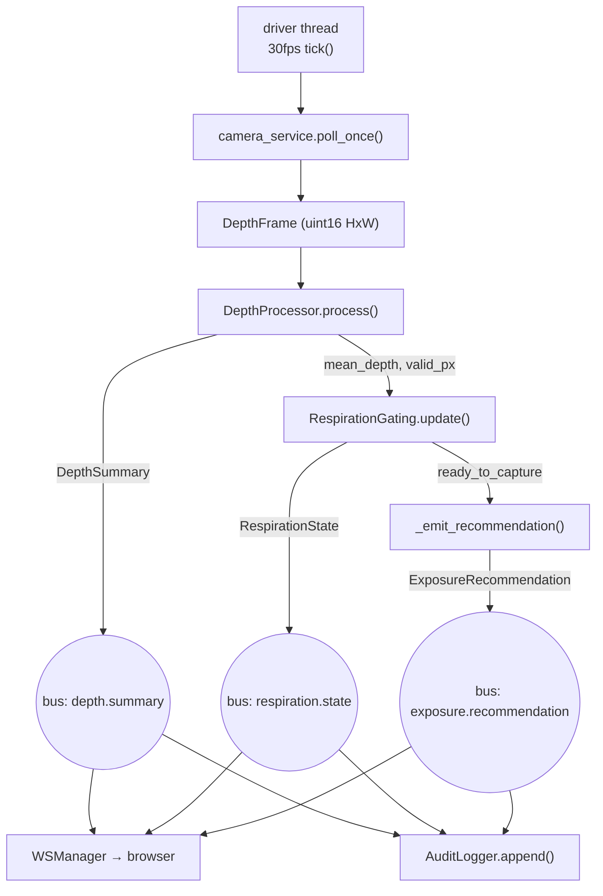

# Architecture & pipeline

[← back to README](../README.md) · [한국어](architecture.ko.md)

## Process model

Phase 1 is a **single-process pipeline**. The orchestrator ([`app.py`](../smart-xray-assist/src/xray_assist/app.py)) wires camera → depth processing → gating → recommendation → audit through an event bus, and owns the session and safe-state.

**Why single process.** The MVP starts as one worker to minimise latency and complexity (tech-stack §10). But because services talk **only through the bus**, the pipeline is transport-independent — a later ZeroMQ/NNG process split swaps the bus implementation, not the pipeline code.

## Transport map (design intent)

The bus abstraction is chosen so each hop can later adopt the right transport (`en/files/api-schema.md`):

| Segment | Transport | Reason |
|---|---|---|
| camera_service → depth_processor | Shared-memory ring buffer (`memfd_create` + seal, SPSC) | ~100 MB/s raw frames; copying is forbidden |
| depth_processor → gating / recommender | ZeroMQ PUB/SUB or gRPC stream | low-latency event delivery |
| api_gateway → UI | WebSocket | real-time state display |
| services → SQLite | SQLite WAL | local single-device audit |

> Caveat carried from the specs: ZeroMQ PUB **silently drops** slow subscribers at the high-water mark. Any production split must set an explicit HWM/drop policy (or move to NNG) so respiration/recommendation events cannot vanish unnoticed.

## Event bus

[`common/event_bus.py`](../smart-xray-assist/src/xray_assist/common/event_bus.py) — topic-based pub/sub. When a pipeline stage publishes a result, two subscribers receive it:

- **API gateway** — pushes to the browser over WebSocket
- **Audit logger** — records into the hash chain

Because the bus is the only coupling point, pipeline code doesn't know who is listening. That is the key to transport independence.

## Driver & session lifecycle

- The **driver thread** in [`run_mvp.py`](../smart-xray-assist/scripts/run_mvp.py) runs `tick()` at 30 fps regardless of session state, so `depth.summary` and `respiration.state` always stream.
- **Starting a session** (`POST /api/v1/sessions`) calls the gating's `start_tracking()` to re-arm tracking.
- A **recommendation** is emitted only when gating reaches `ready_to_capture`.

## Safe state (Manual Mode)

If any stage raises `SafeStateError`, the orchestrator enters safe state:

| Cause | Code |
|---|---|
| Camera disconnected | `CAMERA_DISCONNECTED` |
| Frame drops exceeded / USB 2.0 fallback | `FRAME_DROP_EXCEEDED` |
| ROI valid-pixel ratio too low | `LOW_CONFIDENCE` |
| Empty-bed plane drift | `CALIBRATION_DRIFT` |
| Calibration signature mismatch | `CALIBRATION_MISSING` |
| Audit DB write failure | `DB_WRITE_FAILED` |
| Config/model signature invalid | `CONFIG_SIGNATURE_INVALID` / `MODEL_SIGNATURE_INVALID` |

In safe state, **recommendations are disabled**, `system.error` is published, and the console immediately raises the Manual Mode overlay. Once a good frame is processed again the state auto-clears (transient-fault recovery). The whole safe-state contract is that the **X-ray machine's own manual workflow is never touched** — if this system dies, imaging proceeds as usual.

## Threading note

While the driver thread runs the pipeline, the FastAPI thread pool serves REST requests (approve, audit queries). Both touch the same SQLite connection, so:

- the connection uses `check_same_thread=False`
- all audit access is serialised with an `RLock` (single writer, atomic append)

Related: [Audit hash chain](audit-chain.md) · [Verification](verification.md)
