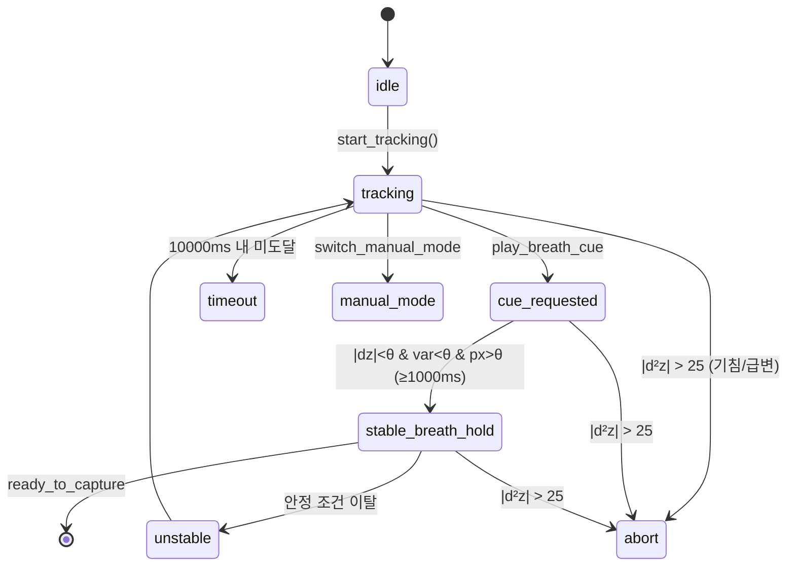

# 깊이 처리 & 호흡 게이팅

[← README로](../README.md)

깊이 카메라는 "표면까지의 거리(z, mm)"만 줍니다. 여기서 **환자 두께**를 뽑고, **안정적인 호흡 정지**를 검출하는 것이 이 두 단계의 역할입니다.

---

## 1. 깊이 처리 파이프라인 (9단계)

[`depth/processor.py`](../smart-xray-assist/src/xray_assist/depth/processor.py)

```
[1] Z16 → mm 변환        [2] 유효성 마스크        [3] depth range gate
[4] 빈 침대 드리프트 체크  [5] ROI crop             [6] IQR 이상치 제거
[7] 시간 EMA             [8] 공간 median          [9] 통계 추출
```

### 두께 산출의 핵심

```
thickness = Z_bed_reference − Z_patient_surface(median)
```

- `Z_bed_reference` = 보정 프로파일의 **빈 침대 평면**(`bed_origin_mm`)
- 카메라에 가까울수록 z가 작음 → 환자가 누우면 표면 z가 작아지고, 그 차이가 두께
- **median을 쓰는 이유**: 깊이 카메라는 반사·의복·경계에서 **홀(0값)** 이 생깁니다. 평균은 홀에 끌려가지만 median은 강건합니다. 그래서 두께의 헤드라인 값은 median 기반입니다.

### 신뢰도 게이트

ROI 내 유효 픽셀 비율 `valid_pixel_ratio`가 임계(`0.85`) 미만이면 `LOW_CONFIDENCE`로 safe-state. 신뢰도는 유효 픽셀 비율과 깊이 표준편차로 계산합니다.

### 보정(Calibration)

[`depth/calibration.py`](../smart-xray-assist/src/xray_assist/depth/calibration.py) — 프로파일은 **서명**되어 있고, 서명이 없거나 불일치하면 서비스가 시작되지 않습니다(`CALIBRATION_MISSING`). 런타임에 빈 침대 평면이 허용치를 넘어 드리프트하면(카메라 흔들림·침대 이동) `CALIBRATION_DRIFT`로 발행을 거부합니다. 콘솔의 "빈 침대 보정(GTS-002)"이 이 프로파일을 갱신하는 절차입니다.

---

## 2. 호흡 게이팅 상태 기계

[`gating/respiration.py`](../smart-xray-assist/src/xray_assist/gating/respiration.py) · 설정 [`configs/gating.yaml`](../smart-xray-assist/configs/gating.yaml)

깊이 신호를 시간에 대해 미분해 **속도 dZ/dt** 와 **가속도 d²Z/dt²** 를 얻고, 이걸로 상태를 전이합니다.



### 안정(stable) 판정 조건

세 조건을 **동시에** 만족해야 안정입니다:

| 조건 | 임계 (기본값) | 의미 |
|---|---|---|
| `|dZ/dt|` < `stable_dz_dt_threshold` | 2.0 mm/s | 표면이 거의 안 움직임 |
| 롤링 분산 < `stable_variance_threshold` | 0.03 | 최근 15 샘플이 평탄 |
| `valid_pixel_ratio` > `min_valid_pixel_ratio` | 0.85 | 프레임 품질 충분 |

이 상태가 **`min_stable_duration_ms`(1000ms)** 이상 지속되면 → `stable_breath_hold` → `ready_to_capture=true` → 추천 발행.

### 기침 abort — 왜 가속도인가

기침·재채기·갑작스런 움직임은 **표면의 급격한 2차 변화**로 나타납니다. 속도(dZ/dt)만 보면 느린 드리프트와 구분이 어렵지만, **가속도 d²Z/dt²** 는 급변에만 크게 튑니다. `|d²Z/dt²| > 25 mm/s²` 이면 즉시 `abort`.

### EMA 평활 — 양자화 잡음 억제

깊이 센서의 Z16은 **1mm 계단(quantization)** 을 갖습니다. 이 계단이 그대로 2차 미분에 들어가면 d²Z/dt²가 폭발해 기침이 아닌데도 abort가 납니다. 그래서 z·dz/dt·샘플 간격에 **지수이동평균(EMA)** 을 겁니다:

```
ema ← α·현재값 + (1−α)·이전ema     (α_z=0.3, α_dz=0.3, α_dt=0.2)
```

- 낮은 α = 무거운 평활
- 필터가 수렴하기 전(`warmup_frames`=8, ≈0.3s @30fps)에는 기침 abort를 억제해 오탐을 막습니다.

> 프론트엔드 콘솔은 이 게이팅 로직과 **동일한 상태 이름·임계값**을 사용해 백엔드 WS 메시지를 렌더합니다. 즉 화면의 상태 전이는 백엔드 게이팅을 그대로 반영합니다.

관련: [노출 추천 & 안전](exposure-and-safety.md)
