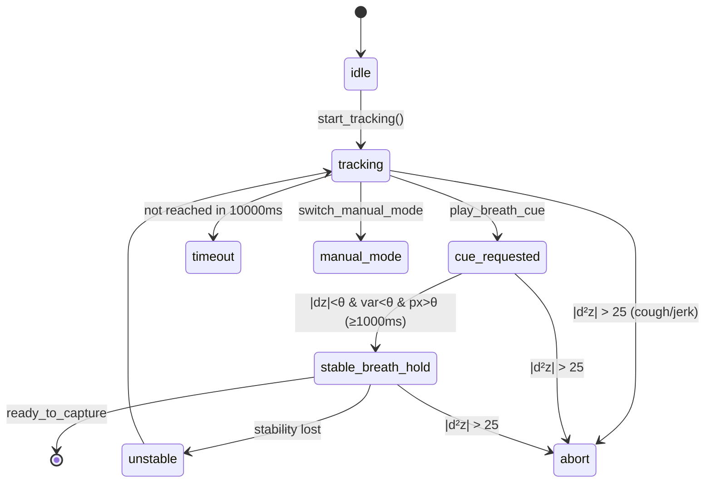

# Depth processing & respiration gating

[← back to README](../README.md) · [한국어](depth-and-gating.ko.md)

A depth camera only gives "distance to the surface (z, mm)". These two stages turn that into a **patient thickness** and a robust **stable breath-hold** detection.

---

## 1. Depth processing pipeline (9 steps)

[`depth/processor.py`](../smart-xray-assist/src/xray_assist/depth/processor.py)

```
[1] Z16 → mm                 [2] validity mask            [3] extrinsic correction [R|t]
[4] depth range gate         [5] ROI crop                 [6] IQR outlier rejection
[7] temporal EMA             [8] spatial median           [9] stat extraction
```

The full spec (`en/files/camera.md`) also inserts an **empty-bed calibration compensation** and **extrinsic transform** (camera frame → bed frame) before ROI crop.

### The core of thickness derivation

```
thickness = Z_bed_reference − Z_patient_surface(median)
```

- `Z_bed_reference` = the calibration profile's **empty-bed plane** (`bed_origin_mm`, e.g. `1112.7`)
- Closer to the camera ⇒ smaller z. When a patient lies down, surface z shrinks; that difference is the thickness.
- **Why median, not mean:** hospital gowns and linens absorb the IR pattern, creating **depth holes (zeros)**. The mean is dragged toward holes; the median is robust. So the headline thickness is median-based, EMA-smoothed.

### Confidence gate

If the ROI `valid_pixel_ratio` falls below the threshold (`0.85`), the processor enters `LOW_CONFIDENCE` safe state. Confidence is computed from the valid-pixel ratio and depth standard deviation, and the summary also carries `ir_saturation`, `motion_artifact`, and `clothing_artifact_score` (0–1).

### Calibration (signed)

[`depth/calibration.py`](../smart-xray-assist/src/xray_assist/depth/calibration.py) — the profile is **Ed25519-signed**; a missing or mismatched signature blocks service startup (`CALIBRATION_MISSING`). Profile schema fields:

| Field | Example |
|---|---|
| `profile_id` | `calib_room_a_20260624` |
| `schema_version` | `1.0.0` |
| `bed_origin_mm` | `1112.7` |
| `extrinsic_matrix_4x4` | 4×4 transform |
| `roi_templates` | per exam (chest_pa: x, y, width, height) |
| `valid_pixel_ratio_baseline` | `0.93` |
| `signature` | Ed25519 |

At runtime, a **daily empty-bed drift check** runs at service start; if the plane drifts beyond tolerance (camera bumped, table moved) it logs `CALIBRATION_DRIFT` and refuses to publish. The console's "Empty-bed calibration (GTS-002)" is the procedure that refreshes this profile.

---

## 2. Respiration gating state machine

[`gating/respiration.py`](../smart-xray-assist/src/xray_assist/gating/respiration.py) · config [`configs/gating.yaml`](../smart-xray-assist/configs/gating.yaml)

The depth signal is differentiated in time to get **velocity dZ/dt** and **acceleration d²Z/dt²**, which drive state transitions:

```
dZ/dt   = (Z[t] − Z[t-1]) / Δt        # velocity
d²Z/dt² = (dZ/dt[t] − dZ/dt[t-1]) / Δt # acceleration (cough/jerk)
```



### Stable-hold conditions

All three must hold **simultaneously**:

| Condition | Threshold (default) | Meaning |
|---|---|---|
| `|dZ/dt|` < `stable_dz_dt_threshold_mm_s` | 2.0 mm/s | surface barely moving |
| rolling variance < `stable_variance_threshold` | 0.03 | last 15 samples flat |
| `valid_pixel_ratio` > `min_valid_pixel_ratio` | 0.85 | frame quality sufficient |

Sustained for **`min_stable_duration_ms` (1000 ms)** → `stable_breath_hold` → `ready_to_capture=true` → recommendation emitted. If not reached within `timeout_ms` (10000 ms) → `timeout`.

### Cough abort — why acceleration

A cough/jerk shows up as a **sharp second-order change** of the surface. Velocity alone can't separate it from slow drift, but **acceleration d²Z/dt²** spikes only on abrupt change. `|d²Z/dt²| > 25 mm/s²` ⇒ immediate `abort`, bypassing the velocity check. This orthogonality is what makes the abort cough-specific.

### EMA smoothing — suppressing quantisation

The Z16 sensor has **1 mm quantisation steps**. Fed straight into a second derivative, those steps blow up d²Z/dt² and cause false aborts. So z, dZ/dt, and the sample interval each get an **exponential moving average**:

```
ema ← α·value + (1−α)·ema_prev     (α_z=0.3, α_dz=0.3, α_dt=0.2)
```

Lower α = heavier smoothing. Cough abort is suppressed until the filters converge (`warmup_frames`=8, ≈0.3 s @30 fps) to avoid startup false positives.

### Audio breath-hold cue

The guided-breath cue's audio path has real latency. The spec routes audio via **GStreamer direct ALSA** (not PulseAudio) to minimise variance, and `audio_latency_offset_ms` is **measured per device at installation** (e.g. 1800 ms) — never assumed. Target spread < 20 ms across 10 reps (TC-AUDIO-002).

### Latency & validation targets

| Metric | Target | Test |
|---|---|---|
| Internal gating latency | ≤ 33 ms (one 30 fps frame) | TC-GATE-003 |
| Stable-window detection | ≥ 9/10 trials | GTS-004 |
| Breathing phantom | amplitudes 5/10/20/50 mm; periods 2/4/6 s + irregular | TC-GATE-003 |

> The frontend console uses the **same state names and thresholds**, so on-screen transitions faithfully mirror backend gating. See [Operator console](operator-console.md).

Related: [Exposure & safety](exposure-and-safety.md) · [Verification](verification.md)
